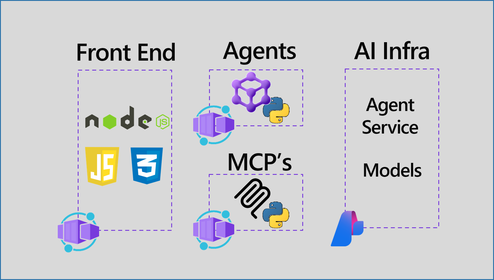

# Weather AI Agent

> A conversational AI weather assistant powered by Microsoft Agent Framework, Model Context Protocol (MCP), and Azure services.

[](https://azure.microsoft.com/)
[](https://learn.microsoft.com/en-us/azure/ai-foundry/)
[](https://learn.microsoft.com/en-us/agent-framework/)
[](https://spec.modelcontextprotocol.io/)



## Overview

This project demonstrates a production-ready AI agent system that provides conversational weather information through natural language queries. It showcases:

- 🤖 **Microsoft Agent Framework**: Building AI agents with tool integration
- 🔧 **Model Context Protocol (MCP)**: Standardized tool interfaces for AI systems
- ☁️ **Microsoft Foundry**: Hosted agent deployment on Azure
- 📦 **Azure Container Apps**: Scalable, serverless container hosting
- 🎨 **Next.js Frontend**: Modern web UI with streaming responses

## Architecture

```
┌─────────────────┐     HTTPS      ┌─────────────────┐     MCP/HTTP    ┌─────────────────┐
│   Frontend      │────────────────▶│   Backend       │────────────────▶│   MCP Server    │
│   (Next.js)     │◀────────────────│  (AI Agent)     │◀────────────────│  (Weather Tool) │
│                 │     SSE          │                 │                  │                 │
│  - Chat UI      │                 │  - Agent        │                  │  - get_weather  │
│  - Streaming    │                 │  - Foundry      │                  │  - Mock data    │
│                 │                 │  - MCP Tool     │                  │                 │
└─────────────────┘                 └────────┬────────┘                 └─────────────────┘
                                             │
                                             │
                                             ▼
                                    ┌─────────────────┐
                                    │  Azure OpenAI   │
                                    │   (Foundry)     │
                                    │  - gpt-4o-mini  │
                                    └─────────────────┘
```

## Features

### For Users
- 💬 Natural language weather queries
- 🌍 Weather information for any city
- ⚡ Real-time streaming responses
- 📱 Responsive mobile and desktop UI

### For Developers
- 🏗️ Clean, modular architecture
- 🐳 Container-ready deployment
- 📖 Comprehensive documentation
- 🧪 Testing scripts included
- 🔐 Azure managed identity support

## Quick Start

### Prerequisites

- **Python 3.12+**
- **Node.js 20+** (for frontend)
- **Azure CLI** authenticated (`az login`)
- **Azure OpenAI resource** with deployed model
- **Docker** (optional, for containerization)

### 1. Clone the Repository

```bash
git clone https://github.com/YOUR-ORG/spec2cloud-weather-agent.git
cd spec2cloud-weather-agent
```

### 2. Start the MCP Server

```powershell
cd src/mcp-server
pip install -r requirements.txt
python server.py
# Server runs at http://localhost:8000/mcp
```

### 3. Start the Backend Agent

```powershell
cd src/backend

# Set environment variables
$env:AZURE_OPENAI_ENDPOINT="https://YOUR-RESOURCE.openai.azure.com/"
$env:AI_MODEL_DEPLOYMENT="gpt-4o-mini"

# Install and run
pip install -r requirements.txt
python main.py
# Agent runs at http://localhost:8088
```

See [Backend Quick Start](src/backend/QUICKSTART.md) for detailed setup.

### 4. Test the Backend

```powershell
cd src/backend
.\test_agent.ps1
```

### 5. Start the Frontend (Coming Soon)

```powershell
cd src/frontend
npm install
npm run dev
# Frontend at http://localhost:3000
```

## Project Structure

```
spec2cloud-weather-agent/
├── src/
│   ├── backend/              # ⭐ AI Agent (Microsoft Agent Framework)
│   │   ├── main.py          #    Agent implementation
│   │   ├── requirements.txt #    Python dependencies
│   │   ├── Dockerfile       #    Container config
│   │   ├── README.md        #    Detailed docs
│   │   ├── QUICKSTART.md    #    5-minute setup
│   │   └── run_local.ps1    #    Dev script
│   │
│   ├── mcp-server/          # 🔧 Weather MCP Tool (FastMCP)
│   │   ├── server.py        #    MCP server implementation
│   │   ├── requirements.txt #    Python dependencies
│   │   └── README.md        #    Documentation
│   │
│   └── frontend/            # 🎨 Web UI (Next.js) - Coming Soon
│
├── infra/                   # 🏗️ Azure Infrastructure (Bicep)
│   ├── main.bicep          #    Main infrastructure
│   └── core/               #    Reusable modules
│
├── specs/                   # 📋 Requirements & Design
│   ├── PRD.md              #    Product requirements
│   └── FRD.md              #    Functional requirements
│
├── .github/                # 🛠️ Skills & Workflows
│   └── skills/             #    Reusable patterns
│       ├── hosted-agents/  #    Agent deployment patterns
│       └── mcp-builder/    #    MCP server patterns
│
└── azure.yaml              # Azure Developer CLI config
```

## Component Details

### Backend Agent
- **Framework**: Microsoft Agent Framework
- **Language**: Python 3.12+
- **Model**: Azure OpenAI (gpt-4o-mini)
- **API**: OpenAI Responses protocol with SSE
- **Deployment**: Azure Container Apps via Foundry

[📖 Backend Documentation](src/backend/README.md)

### MCP Server
- **Framework**: FastMCP
- **Language**: Python 3.12+
- **Tools**: `get_weather(city)` with mock data
- **Transport**: HTTP with streamable protocol

[📖 MCP Server Documentation](src/mcp-server/README.md)

### Frontend
- **Framework**: Next.js 14+
- **Language**: TypeScript
- **UI**: Tailwind CSS
- **Features**: Chat interface, SSE streaming

[📖 Frontend Documentation](src/frontend/README.md) _(Coming Soon)_

## Development

### Local Development

```powershell
# Terminal 1: MCP Server
cd src/mcp-server && python server.py

# Terminal 2: Backend Agent
cd src/backend && .\run_local.ps1

# Terminal 3: Frontend (when available)
cd src/frontend && npm run dev
```

### Testing

```powershell
# Test backend
cd src/backend
.\test_agent.ps1

# Manual test with curl
curl -sS -H "Content-Type: application/json" -X POST http://localhost:8088/responses -d '{
  "input": {"messages": [{"role": "user", "content": "What is the weather in Paris?"}]},
  "stream": false
}'
```

### Docker

```powershell
# Build backend
cd src/backend
docker build -t weather-agent:latest .
docker run -p 8088:8088 -e AZURE_OPENAI_ENDPOINT="..." weather-agent:latest

# Build MCP server
cd src/mcp-server
docker build -t weather-mcp:latest .
docker run -p 8000:8000 weather-mcp:latest
```

## Deployment

### Using Azure Developer CLI (Recommended)

```powershell
# Initialize (first time)
azd init

# Provision and deploy all resources
azd up

# Deploy updates
azd deploy
```

### Manual Deployment

See [Infrastructure Documentation](infra/README.md) for manual deployment steps using Azure CLI and Bicep.

## Configuration

### Environment Variables

#### Backend
```bash
AZURE_AI_PROJECT_ENDPOINT=https://{account}.services.ai.azure.com/api/projects/{project}
AZURE_OPENAI_ENDPOINT=https://{resource}.openai.azure.com/  # For local dev
AI_MODEL_DEPLOYMENT=gpt-4o-mini
MCP_SERVER_URL=http://127.0.0.1:8000/mcp  # Local dev
```

#### MCP Server
```bash
PORT=8000  # Optional, defaults to 8000
```

See component-specific documentation for more details.

## Key Technologies

- **[Microsoft Agent Framework](https://learn.microsoft.com/en-us/agent-framework/)**: Building AI agents with tools
- **[Model Context Protocol](https://spec.modelcontextprotocol.io/)**: Standardized tool interface
- **[Microsoft Foundry](https://learn.microsoft.com/en-us/azure/ai-foundry/)**: Agent hosting and AI model access
- **[Azure Container Apps](https://learn.microsoft.com/en-us/azure/container-apps/)**: Serverless container hosting
- **[FastMCP](https://github.com/jlowin/fastmcp)**: Python MCP server framework
- **[Next.js](https://nextjs.org/)**: React framework for web UI

## Documentation

- **[Product Requirements (PRD)](specs/PRD.md)**: Product vision and requirements
- **[Functional Requirements (FRD)](specs/FRD.md)**: Technical specifications
- **[Backend Guide](src/backend/README.md)**: Backend documentation
- **[Backend Quick Start](src/backend/QUICKSTART.md)**: 5-minute setup
- **[MCP Server Guide](src/mcp-server/README.md)**: MCP server documentation
- **[Hosted Agents Skill](.github/skills/hosted-agents/SKILL.md)**: Agent deployment patterns

## API Reference

### Backend Agent API

**Endpoint**: `POST /responses`

**Request**:
```json
{
  "input": {
    "messages": [
      {"role": "user", "content": "What's the weather in Tokyo?"}
    ]
  },
  "stream": false
}
```

**Response**:
```json
{
  "output": [
    {
      "role": "assistant",
      "content": "The current weather in Tokyo is..."
    }
  ],
  "usage": {"input_tokens": 25, "output_tokens": 50}
}
```

**Streaming**: Set `"stream": true` for SSE streaming responses.

## Troubleshooting

### Common Issues

**Backend won't start**
- Ensure environment variables are set (see `.env.example`)
- Check Azure authentication: `az account show`
- Verify Azure OpenAI endpoint and deployment name

**MCP server unreachable**
- Ensure MCP server is running on port 8000
- Check `MCP_SERVER_URL` environment variable
- Test directly: `curl http://localhost:8000/mcp`

**Agent not calling weather tool**
- Verify MCP server is accessible from backend
- Check agent logs for tool invocation errors
- Ensure MCP server URL is correct

See component-specific documentation for detailed troubleshooting.

## Contributing

Contributions are welcome! Please:

1. Read the [FRD](specs/FRD.md) and [PRD](specs/PRD.md)
2. Follow existing code patterns
3. Add tests for new features
4. Update documentation

## License

This project is licensed under the MIT License - see [LICENSE.md](LICENSE.md) for details.

## Resources

### Documentation
- [Microsoft Agent Framework Docs](https://learn.microsoft.com/en-us/agent-framework/)
- [Model Context Protocol Spec](https://spec.modelcontextprotocol.io/)
- [Azure AI Foundry](https://learn.microsoft.com/en-us/azure/ai-foundry/)
- [Azure Container Apps](https://learn.microsoft.com/en-us/azure/container-apps/)

### Related Projects
- [FastMCP](https://github.com/jlowin/fastmcp) - Python MCP framework
- [MCP Servers](https://github.com/modelcontextprotocol/servers) - Official MCP server implementations
- [Agent Framework Samples](https://github.com/microsoft/agent-framework/tree/main/samples) - More agent examples

## Support

For issues and questions:
- 📖 Check component READMEs first
- 🐛 Open an issue for bugs
- 💬 Discussions for questions
- 📧 Contact the team

---

**Made with ❤️ using Microsoft Agent Framework and Model Context Protocol**
